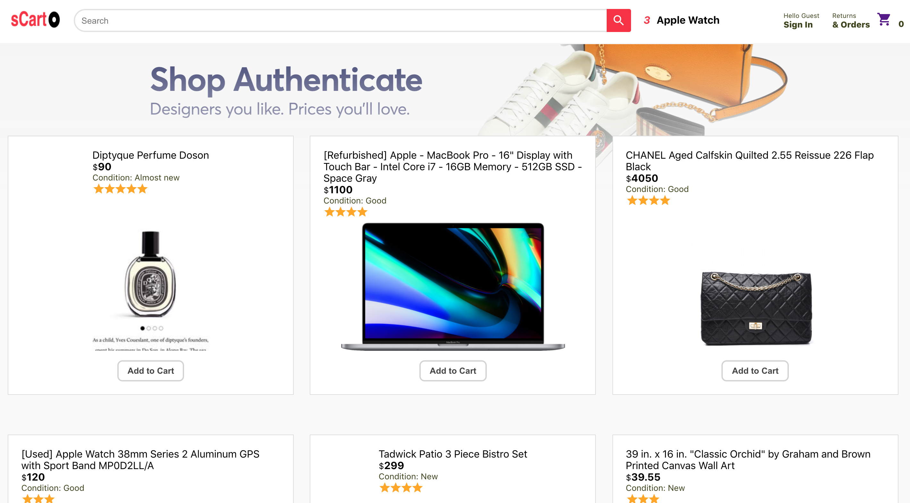

# sCart App
  > E-commerce website 'sCart - Find your taste'
  - The easy way to sell or buy almost anything.
  - If you get something you don't use, never used or just outgrew? Sell it.

## Features
  - Login & Signup
  - Checkout & Order
  - Payment
  - Trending Items

## Screenshot

## Deploy
  > https://e-commerce-scart.web.app/
  or
  > https://jinyeong-park.github.io/s-cart-store/

### `npm start`

Runs the app in the development mode.\
Open [http://localhost:3000](http://localhost:3000) to view it in the browser.

### `npm run build`

Builds the app for production to the `build` folder.\
It correctly bundles React in production mode and optimizes the build for the best performance.

The build is minified and the filenames include the hashes.\
Your app is ready to be deployed!

